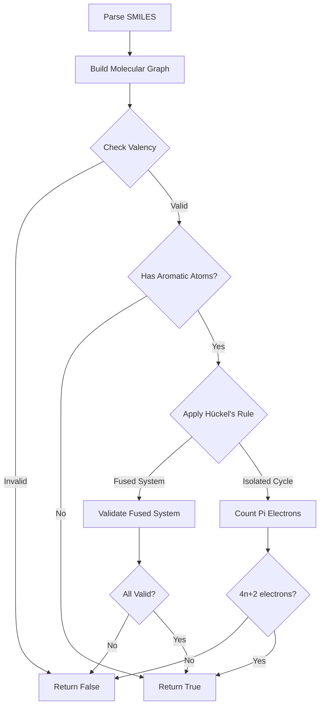

# Chemical Validation Algorithms

This document describes the chemistry validation algorithms used by the SMILES parser to ensure molecular structures are chemically valid.

## Overview

The validation system checks two main aspects of molecular chemistry:

1. **Aromaticity Validation** - Uses Hückel's rule to validate aromatic ring systems
2. **Valency Validation** - Uses the octet rule to validate atom bonding

---

## Hückel's Rule (Aromaticity)

### What is Hückel's Rule?

Hückel's rule is a method to determine if a cyclic, planar molecule is aromatic. A molecule is aromatic if it has **4n+2 π electrons**, where n is a non-negative integer (0, 1, 2, 3, ...).

Common aromatic electron counts:
- n=0: **2 π electrons** (e.g., cyclopropenyl cation)
- n=1: **6 π electrons** (e.g., benzene, pyridine, pyrrole)
- n=2: **10 π electrons** (e.g., naphthalene)
- n=3: **14 π electrons** (e.g., anthracene)

### Implementation

The validation is performed by `MolecularGraph.huckel()`:

```python
n = (pi_electrons - 2) / 4
# Valid if n is a non-negative integer
```

### Pi Electron Counting

Each atom type contributes a specific number of π electrons in `_count_pi_electrons()`:

| Atom Type | π Electrons | Notes |
|-----------|-------------|-------|
| C (aromatic) | 1 | sp² hybridized carbon |
| N (pyridine-like) | 1 | No attached hydrogen |
| N (pyrrole-like) | 2 | Has attached hydrogen `[nH]` |
| O, S | 2 | Lone pair contributes |
| Se, As | 2 | Lone pair contributes |
| B, P | 1 | |

### Fused Ring Systems

For fused aromatic systems (e.g., naphthalene, anthracene), the validator uses relaxed rules:

1. Groups cycles into fused ring systems (sharing 2+ atoms)
2. For complex systems (3+ rings) where all atoms are aromatic, trusts SMILES notation
3. For 2-ring fused systems, validates that at least one cycle satisfies Hückel's rule

See `validate_fused_aromatic_system()`.

---

## Octet Rule (Valency)

### What is the Octet Rule?

The octet rule states that atoms tend to form bonds to achieve 8 electrons in their valence shell (or 2 for hydrogen). This determines how many bonds each atom can form.

Common valencies:
- **Carbon (C)**: 4 bonds
- **Nitrogen (N)**: 3 bonds
- **Oxygen (O)**: 2 bonds
- **Hydrogen (H)**: 1 bond
- **Sulfur (S)**: 2, 4, or 6 bonds

### Implementation

Valency is checked by `MolecularGraph.check_valency_for_aba()`:

```python
total_bonds = hcount + bond_count
if atom.symbol == "C" and total_bonds < 4:
    return False  # Carbon needs 4 bonds
```

### Bracket Atoms

For bracket atoms (e.g., `[CH3]`, `[NH2]`), the validator checks:
1. Explicit hydrogen count (`hcount`)
2. Number of bonds to other atoms
3. Total must satisfy the atom's valency requirement

---

## Validation Flow



---

## Examples

### Valid Molecules

| SMILES | Molecule | Validation |
|--------|----------|------------|
| `c1ccccc1` | Benzene | 6 π electrons (n=1) ✓ |
| `c1ccncc1` | Pyridine | 6 π electrons (n=1) ✓ |
| `c1cc[nH]c1` | Pyrrole | 6 π electrons (N+H contributes 2) ✓ |
| `c1ccc2ccccc2c1` | Naphthalene | Fused system, 10 π electrons ✓ |

### Invalid Molecules

| SMILES | Issue |
|--------|-------|
| `c1cccc1` | 5 atoms but 5 π electrons (not 4n+2) |
| `[CH]` | Carbon with 1 bond (needs 4) |

---

## References

- [Hückel's Rule - Wikipedia](https://en.wikipedia.org/wiki/H%C3%BCckel%27s_rule)
- [Octet Rule - Wikipedia](https://en.wikipedia.org/wiki/Octet_rule)
- [OpenSMILES Specification](http://opensmiles.org/opensmiles.html)
